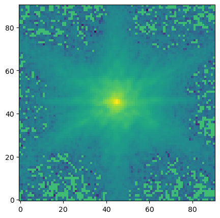
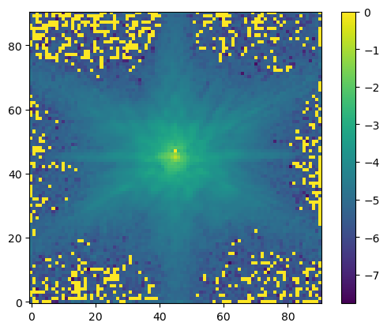
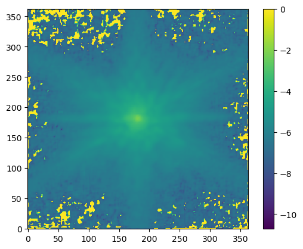
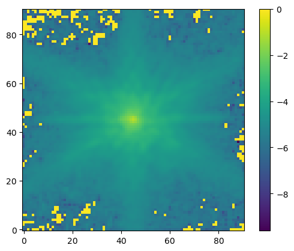
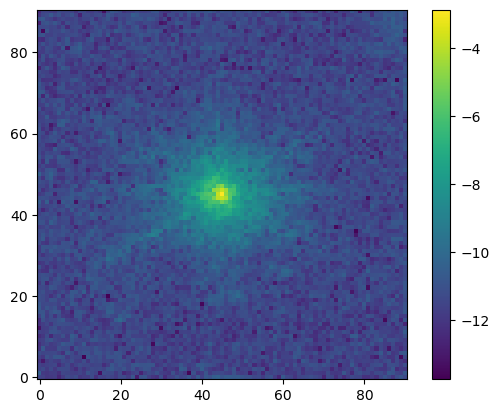

# PSFJ

This a Julia package for PSF(Point spread function) inspired by psfr-python

## JWST star
We using the JWFS star image as an example of the package

## PSF reconstruction
The result of the psf function reconstruction

## Oversampling
The 

## Degraded PSF

## Errormap

